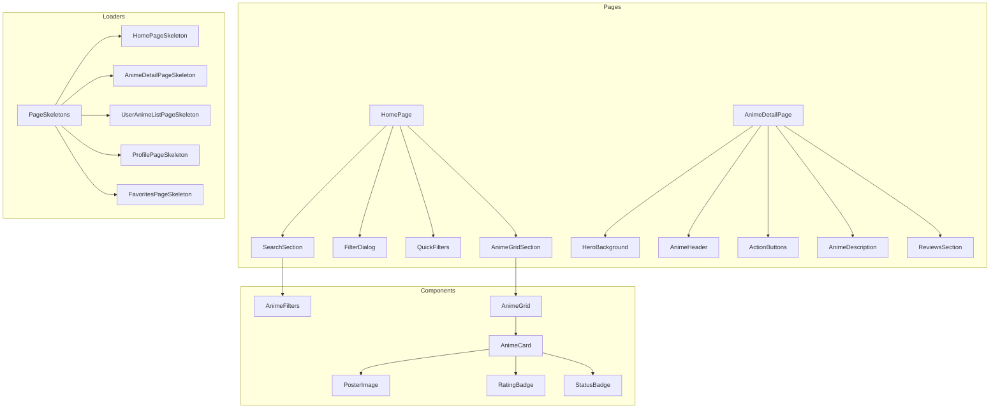

# Анализ Frontend AnimeHako - План улучшений

## 📊 Общая оценка кодовой базы

### Хорошие практики, уже внедрённые:
- ✅ ErrorBoundary для перехвата ошибок
- ✅ Suspense для асинхронной загрузки
- ✅ Skeleton-заглушки для большинства страниц
- ✅ React Query (TanStack Query) для управления состоянием сервера
- ✅ Декомпозиция на отдельные хуки (useAnime, useAuth)
- ✅ Использование shadcn/ui компонентов

---

## 🔴 Критические проблемы

### 1. Нет react-error-boundary с reset functionality
**Текущая реализация:** `ErrorBoundary` просто перезагружает страницу при reset.
**Проблема:** Не позволяет восстановиться без перезагрузки всей страницы.
**Решение:** Добавить componentStack и более умный fallback.

### 2. Нет react-query's `suspense: true` + useSuspenseQuery
**Текущая реализация:** Ручная проверка `isLoading` и возврат skeleton.
**Проблема:** Не используется встроенный в React Query Suspense integration.
**Решение:** Внедрить `useSuspenseQuery` для прозрачной работы с Suspense.

### 3. LoginPage и RegisterPage не используют Suspense
**Проблема:** Эти страницы не обёрнуты в Suspense с skeleton.
**Решение:** Создать LoginPageSkeleton и RegisterPageSkeleton.

---

## 🟡 Декомпозиция компонентов (рекомендуется)

### HomePage — слишком большой (330 строк)

```
HomePage
├── SearchSection
│   ├── SearchInput (вынесен из основного компонента)
│   └── FilterButton (открывает FilterDialog)
├── FilterDialog (вынесен из DialogContent)
│   ├── RatingFilter
│   ├── YearFilter
│   ├── GenreFilter
│   ├── TagFilter
│   └── FilterActions (Clear/Apply)
├── QuickFilters (сортировка, активные фильтры)
└── AnimeGridSection (условный рендеринг: loading/empty/results)
```

### AnimeDetailPage — слишком большой (230+ строк)

```
AnimeDetailPage
├── HeroBackground (размытый фон)
├── AnimeHeader
│   ├── PosterColumn (изображение + кнопки действий)
│   └── InfoColumn (название, рейтинг, жанры, теги)
├── AnimeDescription (Card с описанием)
├── ReviewsSection (Card с обзорами)
├── AddToListButton (вынесен для reuse)
└── StatusSelector (вынесен для reuse)
```

### AnimeCard — монолитный, нужна декомпозиция

```
AnimeCard
├── PosterImage (с fetch priority optimization)
├── RatingBadge
├── StatusBadge (опционально)
├── FavoriteBadge (опционально)
└── TitleOverlay
```

---

## 🟢 План исправлений

### Фаза 1: Критичные исправления

- [ ] Создать `LoginPageSkeleton` и `RegisterPageSkeleton`
- [ ] Добавить Suspense с skeleton для LoginPage и RegisterPage в App.tsx
- [ ] Внедрить `useSuspenseQuery` для прозрачного Suspense integration
- [ ] Добавить proper error boundary с componentStack

### Фаза 2: Декомпозиция HomePage

- [ ] Вынести `SearchSection` в отдельный компонент
- [ ] Вынести `FilterDialog` содержимое в `AnimeFilters` компонент
- [ ] Вынести `QuickFilters` в отдельный компонент
- [ ] Создать `AnimeGridSection` для условного рендеринга

### Фаза 3: Декомпозиция AnimeDetailPage

- [ ] Вынести `HeroBackground` в отдельный компонент
- [ ] Создать `AnimeHeader` с подкомпонентами
- [ ] Создать `ActionButtons` (favorite, status buttons)
- [ ] Создать `AnimeDescription` компонент
- [ ] Создать `ReviewsSection` компонент

### Фаза 4: Улучшение AnimeCard

- [ ] Разделить на `PosterImage`, `RatingBadge`, `StatusBadge`
- [ ] Добавить поддержку skeleton loading state
- [ ] Оптимизировать lazy loading изображений

### Фаза 5: Code Splitting (если не сделано)

- [ ] Добавить React.lazy() для всех page components
- [ ] Добавить preload для критичных routes

---

## 📁 Целевая структура файлов

```
src/
├── components/
│   ├── loaders/
│   │   ├── PageSkeletons.tsx (существует)
│   │   ├── LoginPageSkeleton.tsx (новый)
│   │   ├── RegisterPageSkeleton.tsx (новый)
│   │   └── ...
│   ├── layout/
│   │   ├── Layout.tsx (существует)
│   │   └── Header.tsx (новый - вынести из Layout)
│   ├── anime/
│   │   ├── AnimeCard.tsx (существует, декомпозировать)
│   │   ├── AnimeGrid.tsx (существует)
│   │   ├── AnimePoster.tsx (новый)
│   │   ├── AnimeRatingBadge.tsx (новый)
│   │   └── AnimeStatusBadge.tsx (новый)
│   └── home/
│       ├── SearchSection.tsx (новый)
│       ├── FilterDialog.tsx (новый)
│       ├── QuickFilters.tsx (новый)
│       └── AnimeGridSection.tsx (новый)
├── pages/
│   ├── HomePage/ (новая папка)
│   │   ├── index.tsx
│   │   ├── SearchSection.tsx
│   │   ├── FilterDialog.tsx
│   │   ├── QuickFilters.tsx
│   │   └── AnimeGridSection.tsx
│   ├── AnimeDetailPage/ (новая папка)
│   │   ├── index.tsx
│   │   ├── HeroBackground.tsx
│   │   ├── AnimeHeader.tsx
│   │   ├── ActionButtons.tsx
│   │   ├── AnimeDescription.tsx
│   │   └── ReviewsSection.tsx
│   └── ...
```

---

## 🎨 Mermaid: Архитектура компонентов после декомпозиции



---

## ⚡ Внедрение Suspense с react-query

### Текущий подход:
```typescript
const { data, isLoading } = useAnimeDetail(id);
if (isLoading) return <Skeleton />;
```

### Рекомендуемый подход:
```typescript
// Option 1: useSuspenseQuery
const { data } = useSuspenseQuery({
  queryKey: ['anime', 'detail', id],
  queryFn: () => animeApi.getDetail(id).then(r => r.data),
});

// Option 2: keep current approach with better skeleton
const { data, isPending } = useAnimeDetail(id);
if (isPending) return <AnimeDetailPageSkeleton />;
```

---

## 📝 Skeleton-заглушки - текущий статус

| Страница | Статус | Файл |
|----------|--------|------|
| HomePage | ✅ Есть | PageSkeletons.tsx |
| AnimeDetailPage | ✅ Есть | PageSkeletons.tsx |
| UserAnimeListPage | ✅ Есть | PageSkeletons.tsx |
| ProfilePage | ✅ Есть | PageSkeletons.tsx |
| FavoritesPage | ✅ Есть | PageSkeletons.tsx |
| LoginPage | ❌ Нет | Нужен LoginPageSkeleton |
| RegisterPage | ❌ Нет | Нужен RegisterPageSkeleton |

---

## 🔧 Быстрые wins

1. **Добавить LoginPageSkeleton и RegisterPageSkeleton** — 15 минут
2. **Обновить App.tsx с proper Suspense** — 10 минут
3. **Добавить useSuspenseQuery wrapper** — 30 минут
4. **Декомпозировать HomePage** — 2-3 часа
5. **Декомпозировать AnimeDetailPage** — 2-3 часа
6. **Оптимизировать AnimeCard** — 1-2 часа